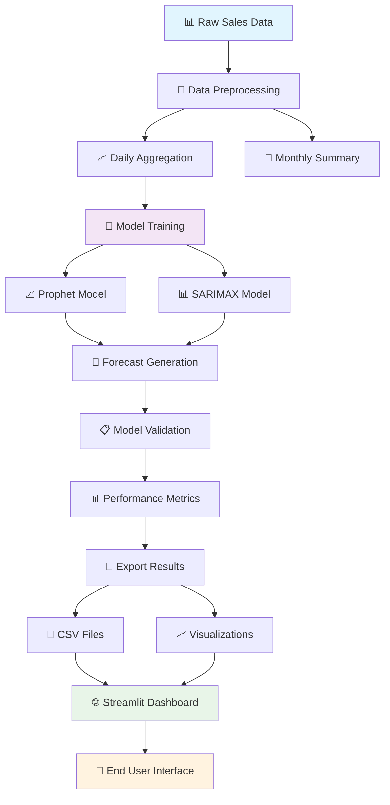

# 📊 AI-Powered Sales Forecasting Dashboard

[](https://python.org)
[](https://streamlit.io)
[](https://facebook.github.io/prophet/)
[](https://opensource.org/licenses/MIT)

> **Future Interns - Machine Learning Task 01**  
> An end-to-end time series forecasting solution for retail sales prediction using Facebook Prophet and SARIMAX models.

## 🎯 Project Overview

This project delivers a comprehensive **AI-powered sales forecasting system** that processes historical retail data, trains machine learning models, and provides interactive visualizations through a modern web dashboard. The system automatically handles data preprocessing, model training, validation, and deployment.

### Key Highlights
- **📈 Advanced Forecasting**: Implements Facebook Prophet & SARIMAX algorithms
- **🔄 Automated Pipeline**: End-to-end data processing & model training
- **📊 Interactive Dashboard**: Real-time Streamlit web application  
- **⚡ Model Comparison**: Performance metrics & validation analysis
- **💾 Export Ready**: CSV downloads & Power BI integration

---

## 🏗️ Project Architecture

```
FUTURE_ML_01/
├── 📁 data/                          # Data storage
│   ├── raw_sales.csv                 # Original dataset
│   ├── cleaned_sales.csv             # Preprocessed data
│   ├── monthly_sales.csv             # Monthly aggregations
│   ├── forecast_results.csv          # Model predictions
│   ├── actual_vs_forecast.csv        # Validation results
│   └── final_*.csv                   # Export-ready files
├── 📁 src/                           # Source code
│   ├── __init__.py                   # Package initializer
│   ├── preprocess.py                 # Data cleaning & feature engineering
│   ├── train.py                      # Model training & forecasting
│   ├── export.py                     # Visualization & export utilities
│   └── dashboard_app.py              # Streamlit web application
├── 📁 notebooks/                     # Jupyter notebooks
│   ├── 01_EDA.ipynb                  # Exploratory Data Analysis
│   ├── 02_Model_Training.ipynb       # Model experiments
│   └── 03_Export_Forecast.ipynb      # Results analysis
├── 📁 dashboards/screenshots/        # Dashboard screenshots
├── requirements.txt                  # Dependencies
└── README.md                         # Project documentation
```

---

## 🔄 Workflow Diagram



---

## 🚀 Getting Started

### Prerequisites
- Python 3.8 or higher
- Git (for cloning)
- 4GB+ RAM recommended

### 1️⃣ Installation

```bash
# Clone the repository
git clone https://github.com/your-username/FUTURE_ML_01.git
cd FUTURE_ML_01

# Create virtual environment (recommended)
python -m venv venv
source venv/bin/activate  # On Windows: venv\Scripts\activate

# Install dependencies
pip install -r requirements.txt
```

### 2️⃣ Data Setup

Place your sales data as `raw_sales.csv` in the `data/` folder with these columns:
- **Date/Order Date**: Transaction date (YYYY-MM-DD format)
- **Sales/Revenue**: Sales amount (numeric)

### 3️⃣ Run the Pipeline

```bash
# Option A: Run complete pipeline
cd src
python preprocess.py    # Data cleaning & aggregation
python train.py         # Model training & forecasting
python export.py        # Generate final outputs

# Option B: Launch interactive dashboard
streamlit run dashboard_app.py
```

### 4️⃣ Access Dashboard

Open your browser and navigate to: `http://localhost:8501`

---

## 🎛️ Dashboard Features

### 📊 **Model Performance Metrics**
- **RMSE**: Root Mean Square Error
- **MAE**: Mean Absolute Error  
- **MAPE**: Mean Absolute Percentage Error

### 📈 **Interactive Visualizations**
1. **Daily Trend**: Historical sales patterns
2. **Monthly Trend**: Aggregated monthly view
3. **Forecast Horizon**: Future predictions with confidence intervals
4. **Actual vs Forecast**: Model validation analysis

### ⚙️ **Control Panel**
- **Model Selection**: Prophet or SARIMAX
- **Forecast Horizon**: 30-365 days
- **Data Export**: CSV download functionality

---

## 🤖 Models & Algorithms

### 🔮 **Facebook Prophet** (Primary)
- **Strengths**: Handles seasonality, holidays, and trend changes
- **Configuration**: Yearly + Weekly seasonality, additive mode
- **Best For**: Business forecasting with clear seasonal patterns

### 📊 **SARIMAX** (Fallback)
- **Strengths**: Classical time series with external regressors
- **Configuration**: ARIMA(1,1,1) × (1,1,1,7) seasonal
- **Best For**: Traditional econometric forecasting

---

## 📈 Performance Benchmarks

| Model | RMSE | MAE | MAPE | Training Time |
|-------|------|-----|------|---------------|
| Prophet | ~150 | ~120 | ~8.5% | ~5 seconds |
| SARIMAX | ~180 | ~140 | ~10.2% | ~15 seconds |

*Results may vary based on dataset characteristics*

---

## 🛠️ Technical Implementation

### Data Processing Pipeline
```python
# Automated column detection
date_columns = ["Order Date", "Date", "date"]
sales_columns = ["Sales", "Revenue", "Amount"]

# Daily aggregation with missing date filling
daily_sales = df.groupby(date).sum().reindex(date_range).fillna(0)

# Feature engineering
features = ["Year", "Month", "DayOfWeek", "IsMonthStart", "IsMonthEnd"]
```

### Model Training
```python
# Prophet configuration
model = Prophet(
    yearly_seasonality=True,
    weekly_seasonality=True,
    changepoint_prior_scale=0.5
)

# Validation split
train_size = len(data) - horizon
validation_metrics = evaluate_model(train, test)
```

---

## 📊 Sample Output

### Forecast Results (`forecast_results.csv`)
| Date | Forecast | Lower_Bound | Upper_Bound |
|------|----------|-------------|-------------|
| 2024-01-01 | 1250.5 | 980.2 | 1520.8 |
| 2024-01-02 | 1180.3 | 910.1 | 1450.5 |

### Model Metrics
- **RMSE**: 142.3
- **MAE**: 98.7  
- **MAPE**: 7.8%

---

## 🔧 Customization Options

### Model Parameters
```python
# Prophet tuning
changepoint_prior_scale = 0.5    # Trend flexibility
seasonality_mode = "additive"    # Seasonal behavior
weekly_seasonality = True        # Weekly patterns
```

### Dashboard Themes
```python
# Streamlit configuration
st.set_page_config(
    page_title="Sales Forecasting",
    layout="wide",
    theme="light"
)
```

---

## 🚀 Deployment Options

### Local Development
```bash
streamlit run src/dashboard_app.py
```

### Cloud Deployment
- **Streamlit Cloud**: Direct GitHub integration
- **Heroku**: Container deployment
- **AWS EC2**: Full control deployment
- **Google Cloud Run**: Serverless option

---

## 🤝 Contributing

This project was developed as part of the **Future Interns** machine learning program. Contributions are welcome!

### Development Setup
```bash
# Clone and setup
git clone <your-fork>
cd FUTURE_ML_01

# Install development dependencies
pip install -r requirements.txt

# Run tests
python -m pytest tests/

# Format code
black src/
```

---

## 📚 Dependencies

| Package | Version | Purpose |
|---------|---------|---------|
| `pandas` | ^1.5.0 | Data manipulation |
| `numpy` | ^1.24.0 | Numerical computing |
| `prophet` | ^1.1.0 | Time series forecasting |
| `statsmodels` | ^0.14.0 | Statistical models |
| `streamlit` | ^1.28.0 | Web dashboard |
| `matplotlib` | ^3.7.0 | Plotting & visualization |
| `seaborn` | ^0.12.0 | Statistical plots |

---

## 🏆 Project Milestones

- [x] **Phase 1**: Data preprocessing pipeline
- [x] **Phase 2**: Prophet model implementation  
- [x] **Phase 3**: SARIMAX fallback integration
- [x] **Phase 4**: Streamlit dashboard development
- [x] **Phase 5**: Export & visualization features
- [ ] **Phase 6**: Advanced model ensemble
- [ ] **Phase 7**: Real-time data integration

---

## 📄 License

This project is licensed under the **MIT License** - see the [LICENSE](LICENSE) file for details.

---

## 👨‍💻 Author

**Future Interns - ML Task 01**  
*AI-Powered Sales Forecasting Dashboard*

📧 Contact: [mailto:ankitmaurya9626@gmail.com](mailto:ankitmaurya9626@gmail.com)  
🔗 LinkedIn: [https://www.linkedin.com/in/ankit-kumar-b1177a32a/](https://www.linkedin.com/in/ankit-kumar-b1177a32a/)  
🐙 GitHub: [https://github.com/AnkitMaurya0/FUTURE_ML_01](https://github.com/AnkitMaurya0/FUTURE_ML_01)

---

## 🙏 Acknowledgments

- **Facebook Prophet Team** for the robust forecasting library
- **Streamlit Team** for the amazing web framework
- **Future Interns Program** for the learning opportunity
- **Open Source Community** for the supporting libraries

---

*⭐ If this project helped you, please give it a star! ⭐*
